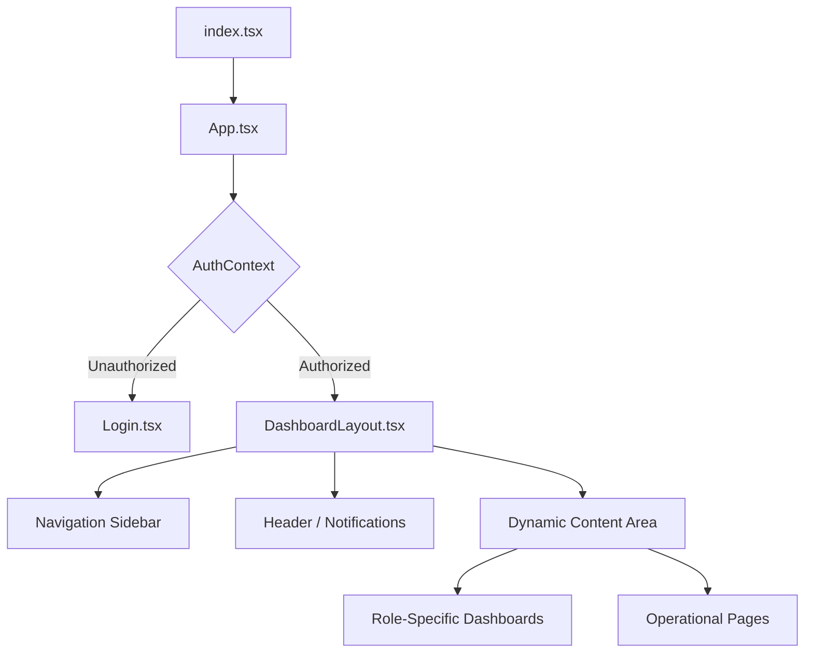

# GAPT UI/UX Architecture

The GAPT interface is built on a **Modular Dashboard Pattern** utilizing Role-Based Access Control (RBAC).

## Component Hierarchy

## Design Language (Figma Sync)
All visual development is driven by the [Figma Design System](./FIGMA_DESIGN_SYSTEM.md). 

### Key Principles:
1. **Institutional Modernism**: High-contrast dark surfaces with vibrant accent colors (Indigo/Emerald).
2. **High-Tactility Components**: Cards use large border radii (`3rem`) to feel like physical objects within a digital space.
3. **Data-Dense Layouts**: Information is organized into "Matrix Grids" to facilitate rapid scanning by staff and administrators.

## User Experience Strategy

### 1. The "Portal Teleport" (Admin Experience)
Administrators have the unique ability to "Teleport" between roles. This is managed via `AuthContext.currentView`.
- **Behavior**: When an Admin switches to "Student" view, the entire application context re-renders from a student's perspective while maintaining the Admin's underlying session.

### 2. Paperless Performance Monitoring
The UI prioritizes "Green Analytics":
- **Gemini Integration**: The `StudentDashboard` calls the `geminiService` to provide AI-driven academic advice based on real-time data.
- **Visual Feedback**: Real-time progress bars and "Green Point" counters motivate users toward digital-first habits.

## Navigation Taxonomy

| Category | Features | Access Level |
| :--- | :--- | :--- |
| **Governance** | Member Directory, Cohort Registry, Access Matrix | Admin, HOD |
| **Academic Ops** | Mark Entry, Attendance, Resources | Staff, HOD |
| **Personal** | Analytics, Leave Requests, Settings | Student, Staff |
