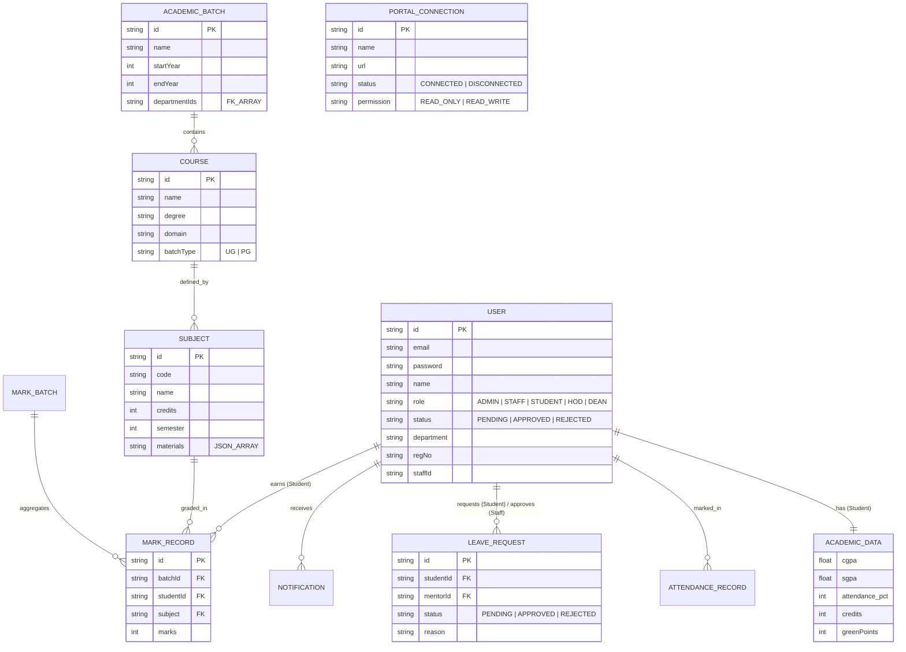

# GAPT Database Entity Relationship Diagram

This diagram represents the relational structure of the Green Academic Performance Tracker (GAPT) system.

## Data Governance Rules
1. **Referential Integrity**: All Student IDs in `MARK_RECORD` must exist in the `USER` table.
2. **Access Control**: Features are unlocked via a `PermissionMap` stored in the `MockDB`.
3. **Auditing**: `NOTIFICATION` records act as the system's audit trail for all significant status changes.
